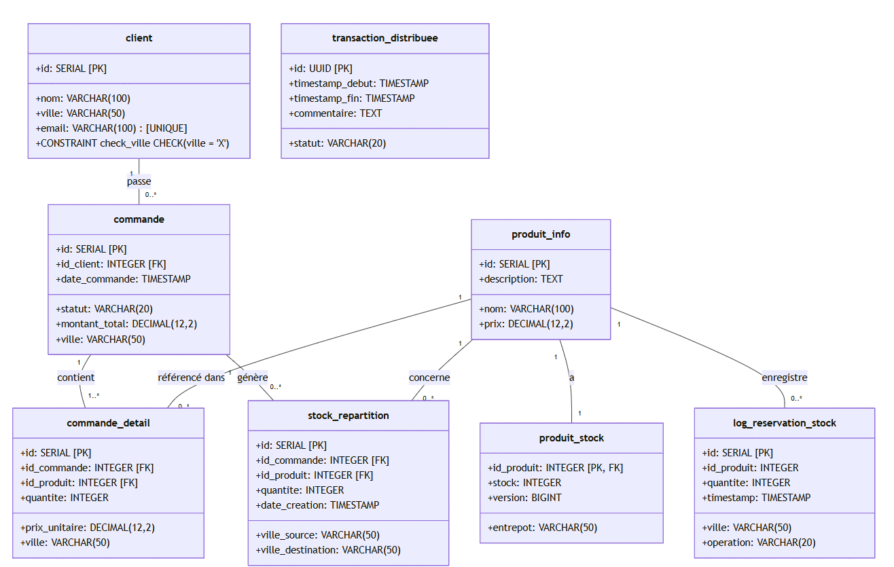
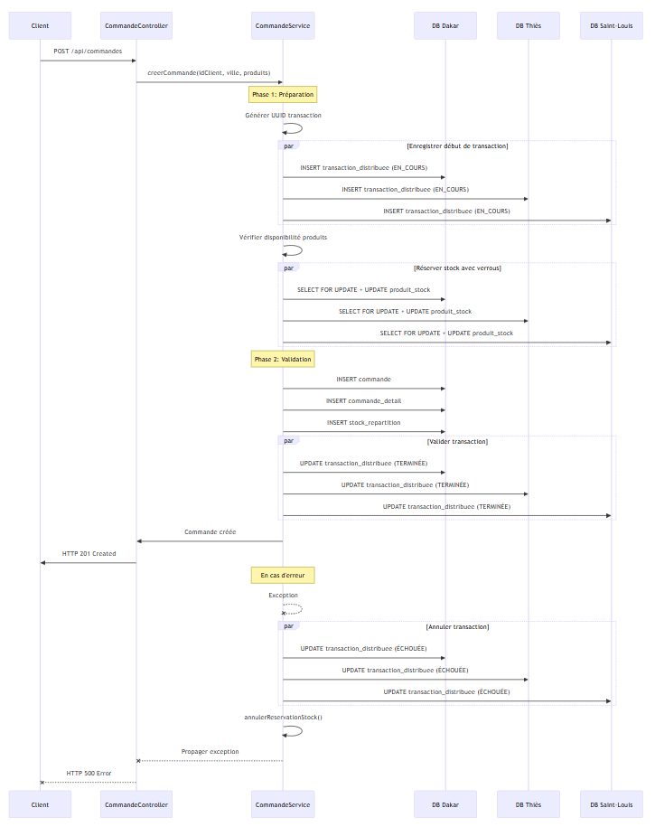
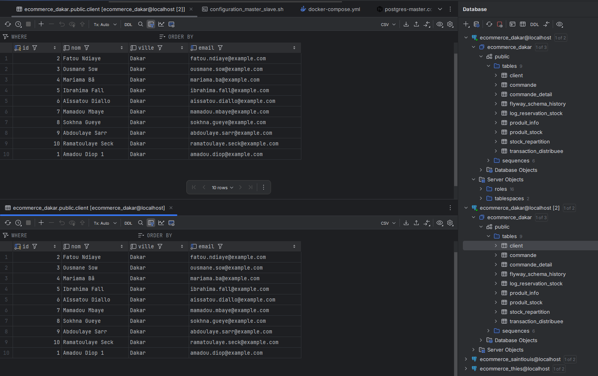

# Mini projet Base de données Réparties
## Par Mouhamadou Diouf Cissé

## information sur le projet

J'ai utilisé Java nottament springboot pour gérer les requetes, les configurations et les API REST. 

Mon rapport final se trouve dans le fichier rapport.md.

Les schémas des bases de données sont dans src/main/resources/db/migration. Vous y trouverez tous les schémas (Dakar, Thiès, Saint-Louis).

la logique metier des requetes(gestion transaction, protocole de validation,...) se trouve dans le package Service.

les api rest se trouvent dans le package Controller.

les configurations de la base de données se trouvent dans le package Config.

les scripts de configuration de la réplication se trouvent dans le dossier init-scripts.

les tests unitaires se trouvent dans src/test/java/dic2/bdRepartit/miniProjet/ConcurencyTest .

Pour les bases de données, j'ai utilisé Postgres version 16 sur Docker.

Vous pouvez créer les conteneurs en exécutant le script configuration_master_slave.sh (en plus de docker-compose up, d'autres commandes de configuration y sont incluses).

Pour appliquer les schémas aux différents conteneurs PostgreSQL, il suffit d'exécuter l'application Spring Boot. Le module Flyway se chargera d'insérer les schémas et de les mettre à jour s'il détecte un changement dans les fichiers de schéma.

tous les services et api rest sont fonctionnels et testés.

##  Partie 1: Modélisation et Fragmentation des Données
### a. Fragmentation horizontale de la table Client
Pour une fragmentation horizontale de la table Client, nous allons diviser les données selon les villes. Chaque site (Dakar, Thiès, Saint-Louis) aura sa propre table contenant les clients de sa région:
```sql
-- Pour le site de Dakar
CREATE TABLE Client_Dakar (
    ID INT PRIMARY KEY,
    Nom VARCHAR(100),
    Ville VARCHAR(50) CHECK (Ville = 'Dakar'),
    Email VARCHAR(100)
);

-- Pour le site de Thiès
CREATE TABLE Client_Thies (
    ID INT PRIMARY KEY,
    Nom VARCHAR(100),
    Ville VARCHAR(50) CHECK (Ville = 'Thiès'),
    Email VARCHAR(100)
);

-- Pour le site de Saint-Louis
CREATE TABLE Client_SaintLouis (
    ID INT PRIMARY KEY,
    Nom VARCHAR(100),
    Ville VARCHAR(50) CHECK (Ville = 'Saint-Louis'),
    Email VARCHAR(100)
);

-- Pour les autres villes
CREATE TABLE Client_Autres (
    ID INT PRIMARY KEY,
    Nom VARCHAR(100),
    Ville VARCHAR(50) CHECK (Ville NOT IN ('Dakar', 'Thiès', 'Saint-Louis')),
    Email VARCHAR(100)
);
```
Cette fragmentation horizontale permettra d'optimiser les accès en stockant les données clients près de leur localisation physique.
### b. Fragmentation verticale de la table Produit
Pour la fragmentation verticale de la table Produit, nous allons diviser les informations générales des produits et celles spécifiques au stock:
```sql
-- Table des informations générales des produits (accessible depuis tous les sites)
CREATE TABLE Produit_Info (
    ID INT PRIMARY KEY,
    Nom VARCHAR(100),
    Description TEXT,
    Prix DECIMAL(10, 2)
);

-- Table des stocks de produits (peut être fragmentée par site également)
CREATE TABLE Produit_Stock (
    ID INT PRIMARY KEY,
    Stock INT,
    FOREIGN KEY (ID) REFERENCES Produit_Info(ID)
);
```
Cette fragmentation verticale permet de séparer les informations qui changent rarement (nom, description, prix) de celles qui sont fréquemment mises à jour (stock).
### c. Implémentation des tables SQL avec insertion de données
Les schemas des tables sont montrés plus haut ,
Voici le script SQL pour insérer les données d'exemple:
```sql
-- Insertion des données clients dans les tables fragmentées
INSERT INTO Client_Dakar (ID, Nom, Ville, Email) VALUES
(1, 'Mamadou Ndiaye', 'Dakar', 'mndiaye@ept.sn'),
(4, 'Fatou Sow', 'Dakar', 'fsow@ept.sn'),
(8, 'Aissatou Diallo', 'Dakar', 'adiallo@ept.sn');

INSERT INTO Client_Thies (ID, Nom, Ville, Email) VALUES
(2, 'Awa Diop', 'Thiès', 'adiop@ept.sn'),
(6, 'Khadija Seck', 'Thiès', 'kseck@ept.sn');

INSERT INTO Client_SaintLouis (ID, Nom, Ville, Email) VALUES
(3, 'Ibrahima Ba', 'Saint-Louis', 'iba@ept.sn'),
(9, 'Cheikh Diagne', 'Saint-Louis', 'cdiagne@ept.sn');

INSERT INTO Client_Autres (ID, Nom, Ville, Email) VALUES
(5, 'Oumar Fall', 'Ziguinchor', 'ofall@ept.sn'),
(7, 'Modou Gaye', 'Kaolack', 'mgaye@ept.sn'),
(10, 'Seynabou Sy', 'Ziguinchor', 'ssy@ept.sn');

-- Insertion des données produits dans les tables fragmentées
INSERT INTO Produit_Info (ID, Nom, Description, Prix) VALUES
(101, 'Ordinateur HP', 'PC portable 15 pouces', 450000),
(102, 'Smartphone Samsung', 'Galaxy S22, 128 Go', 350000),
(103, 'Casque Bluetooth', 'Casque sans fil Sony', 75000),
(104, 'Tablette iPad', 'iPad Air 10.9 pouces', 600000),
(105, 'Disque Dur Externe', '1 To, USB 3.0', 55000),
(106, 'Clavier Mécanique', 'Clavier gamer rétroéclairé', 65000),
(107, 'Imprimante HP Laser', 'Imprimante laser monochrome', 175000),
(108, 'Chargeur Universel', 'Chargeur rapide 65W', 30000),
(109, 'Écouteurs sans fil', 'Écouteurs Bluetooth', 45000),
(110, 'Souris Gamer', 'Souris optique 8000 DPI', 40000);

INSERT INTO Produit_Stock (ID, Stock) VALUES
(101, 20),
(102, 50),
(103, 30),
(104, 15),
(105, 40),
(106, 25),
(107, 10),
(108, 60),
(109, 35),
(110, 45);
```
#### Cette structure permet une gestion optimisée des données client par région et sépare les informations produits selon leur nature (stable vs variable).

## Partie 2: Répartition des Données et Accès Optimisé
### a. Stratégie de Placement des Données
#### architecture de répartition des données:

#### Diagramme de répartition des données:

#### Fragmentation horizontale par région:
Les clients sont stockés dans la base de données de leur ville (Dakar, Thiès, Saint-Louis), avec une contrainte CHECK pour garantir l'intégrité (exemple: CHECK (ville = 'Dakar') dans la base de Dakar).

#### Fragmentation verticale des produits:
produit_info: Contient les informations générales (id, nom, description, prix)
produit_stock: Contient les informations spécifiques au stock local (stock, entrepôt)


#### Tables de support pour la distribution:
transaction_distribuee: Gère les transactions entre les différentes bases
stock_repartition: Suivi des mouvements de stock entre les sites
log_reservation_stock: Enregistrement des opérations de réservation de stock

### b. Redirection Automatique des Requêtes
avec la classe DataSourceRouter pour rediriger les requêtes vers la base de données appropriée en fonction de la ville:

#### Cette implémentation permet:
1. La redirection basée sur la ville du client
2. La recherche intelligente du client dans toutes les bases
3. Une fallback sur Dakar si la ville n'est pas trouvée
4. La normalisation des noms de ville pour gérer les variations d'écriture
5. La gestion des exceptions pour éviter les erreurs de connexion
```java
package dic2.bdRepartit.miniProjet.Service;


import java.util.HashMap;
import java.util.Map;

import org.springframework.beans.factory.annotation.Autowired;
import org.springframework.beans.factory.annotation.Qualifier;
import org.springframework.jdbc.core.JdbcTemplate;
import org.springframework.stereotype.Service;

@Service
public class DataSourceRouter {

    private final JdbcTemplate dakarJdbcTemplate;
    private final JdbcTemplate thiesJdbcTemplate;
    private final JdbcTemplate saintlouisJdbcTemplate;

    private final Map<String, JdbcTemplate> cityDataSources = new HashMap<>();

    @Autowired
    public DataSourceRouter(
            @Qualifier("dakarJdbcTemplate") JdbcTemplate dakarJdbcTemplate,
            @Qualifier("thiesJdbcTemplate") JdbcTemplate thiesJdbcTemplate,
            @Qualifier("saintlouisJdbcTemplate") JdbcTemplate saintlouisJdbcTemplate) {

        this.dakarJdbcTemplate = dakarJdbcTemplate;
        this.thiesJdbcTemplate = thiesJdbcTemplate;
        this.saintlouisJdbcTemplate = saintlouisJdbcTemplate;

        cityDataSources.put("dakar", dakarJdbcTemplate);
        cityDataSources.put("thiès", thiesJdbcTemplate);
        cityDataSources.put("thies", thiesJdbcTemplate);
        cityDataSources.put("saint-louis", saintlouisJdbcTemplate);
    }

    public JdbcTemplate getDataSourceByCity(String city) {
        String normalizedCity = city.toLowerCase();
        return cityDataSources.getOrDefault(normalizedCity, dakarJdbcTemplate); // Dakar par défaut
    }

    public JdbcTemplate getDataSourceForClient(Long clientId) {
        // Déterminer la ville du client à partir de son ID
        String query = "SELECT ville FROM client WHERE id = ?";

        // Essayer d'abord la base de données de Dakar
        try {
            String city = dakarJdbcTemplate.queryForObject(query, String.class, clientId);
            return getDataSourceByCity(city);
        } catch (Exception e) {
            // Si le client n'est pas trouvé à Dakar, essayer Thiès
            try {
                String city = thiesJdbcTemplate.queryForObject(query, String.class, clientId);
                return getDataSourceByCity(city);
            } catch (Exception e2) {
                // Si le client n'est pas trouvé à Thiès, essayer Saint-Louis
                try {
                    String city = saintlouisJdbcTemplate.queryForObject(query, String.class, clientId);
                    return getDataSourceByCity(city);
                } catch (Exception e3) {
                    // Client non trouvé, retourner la base de données par défaut
                    return dakarJdbcTemplate;
                }
            }
        }
    }
}
```

### c. API REST pour les Produits
L'API REST est implémentée à travers:

#### ProduitController: Points d'entrée REST avec les endpoints:

1. /api/produits: Liste tous les produits
2. /api/produits/{id}: Récupère un produit par ID
3. /api/produits/disponibles?ville=: Produits disponibles par ville
4. /api/clients/{clientId}/produits-recommandes: Recommandations personnalisées
5. Endpoints POST pour création et gestion des stocks

#### ProduitService: Logique métier avec fonctionnalités clés:

1. Recherche distribuée de produits à travers toutes les bases
2. Transactions distribuées pour la mise à jour et le transfert de stock
3. Logging des opérations avec gestion d'erreurs
4. Récupération optimisée en fonction de la localisation


## Partie 3: Transactions Réparties et Gestion des Commandes
 Le système permet à un client de passer une commande contenant des produits provenant de plusieurs entrepôts situés dans différentes villes (Dakar, Thiès, Saint-Louis).
### a. Modélisez une transaction répartie lorsqu’un client passe une commande contenant des produits provenant de plusieurs entrepôts.
#### Modèle de Données

Le modèle de données est réparti sur plusieurs bases de données correspondant aux différentes villes:

- **Client**: Fragmenté horizontalement (par ville)
- **Produit**: Fragmenté verticalement (informations générales et stock par ville)
- **Commande**: Centralisée dans la ville du client
- **Répartition du Stock**: Trace les mouvements de stock entre villes

#### Architecture de Transaction Répartie

L'architecture implémente un protocole similaire à la validation en deux phases (2PC) pour garantir l'atomicité des transactions à travers les différentes bases de données.

#### Diagramme de sequence de Flux de Transaction

### b. Implémentez une gestion des transactions avec le protocole de validation en deux phases (2PC).

L'implémentation suit une adaptation du protocole 2PC adaptée aux contraintes du système:

1. Phase de Préparation:

Un UUID est généré pour identifier la transaction distribuée
L'état initial "EN_COURS" est enregistré dans toutes les bases
Le stock est vérifié et réservé avec des verrous (pessimiste et optimiste)


2. Phase de Validation:

Si toutes les réservations sont réussies, la commande est créée
Les détails et la répartition de stock sont enregistrés
Les transactions sont marquées comme "TERMINÉE"


3. Phase d'Annulation:

En cas d'erreur, les réservations sont annulées
Les transactions sont marquées comme "ÉCHOUÉE"
Un message d'erreur est journalisé

c. Écrivez un script SQL permettant d’exécuter une commande en s’assurant
que le stock est mis à jour sur chaque serveur concerné

```sql
-- 1. Enregistrer le début de la transaction dans toutes les bases
INSERT INTO transaction_distribuee (id, statut, timestamp_debut, commentaire)
VALUES (?, 'EN_COURS', CURRENT_TIMESTAMP, ?);

-- 2. Vérifier et réserver le stock (avec verrouillage)
SELECT stock, version FROM produit_stock WHERE id_produit = ? FOR UPDATE;
UPDATE produit_stock SET stock = stock - ?, version = version + 1
WHERE id_produit = ? AND version = ?;
INSERT INTO log_reservation_stock (id_produit, quantite, ville, operation, timestamp)
VALUES (?, ?, ?, 'RESERVE', CURRENT_TIMESTAMP);

-- 3. Créer la commande
INSERT INTO commande (id_client, date_commande, statut, montant_total, ville)
VALUES (?, CURRENT_TIMESTAMP, 'Nouvelle', ?, ?);

-- 4. Créer les détails
INSERT INTO commande_detail (id_commande, id_produit, quantite, prix_unitaire, ville)
VALUES (?, ?, ?, ?, ?);

-- 5. Enregistrer la répartition
INSERT INTO stock_repartition (id_commande, id_produit, quantite, ville_source, ville_destination)
VALUES (?, ?, ?, ?, ?);

-- 6. Mettre à jour le journal
UPDATE transaction_distribuee
SET commentaire = CONCAT(commentaire, E'\n', ?)
WHERE id = ?;

-- 7. Marquer la transaction comme terminée
UPDATE transaction_distribuee
SET statut = 'TERMINÉE', timestamp_fin = CURRENT_TIMESTAMP
WHERE id = ?;

-- En cas d'échec, annuler les réservations
UPDATE produit_stock SET stock = stock + ?, version = version + 1
WHERE id_produit = ?;
INSERT INTO log_reservation_stock (id_produit, quantite, ville, operation, timestamp)
VALUES (?, ?, ?, 'ANNULATION', CURRENT_TIMESTAMP);
UPDATE transaction_distribuee
SET statut = 'ÉCHOUÉE', timestamp_fin = CURRENT_TIMESTAMP, commentaire = ?
WHERE id = ?;
```
## Partie 4: Contrôle de Concurrence et Sérialisabilité
### a. Problèmes potentiels de concurrence lors de la mise à jour du stock
Dans le système actuel, plusieurs problèmes de concurrence peuvent survenir lors de la mise à jour du stock:

1. Race conditions sur le stock:
Dans la méthode reserverStock(), la vérification et la mise à jour du stock ne sont pas atomiques. Entre la lecture du stock disponible et sa mise à jour, une autre transaction pourrait modifier la valeur du stock.
2. Verrous non explicites:
Le code actuel repose uniquement sur les mécanismes d'isolation de transaction par défaut sans verrouillage explicite, ce qui peut conduire à des incohérences en cas d'accès concurrents.
3. Réservations partielles incohérentes:
Si la transaction échoue après avoir réservé du stock dans certaines villes mais pas dans d'autres, la méthode annulerReservationStock() doit être appelée correctement pour restaurer la cohérence.
4. Absence de gestion de version des données:
Le système ne vérifie pas si les données lues sont toujours valides au moment de l'écriture (problème de concurrence optimiste).
5. Pas de détection des interblocages:
Le code ne gère pas explicitement les situations d'interblocage (deadlocks) potentielles lorsque plusieurs transactions attendent mutuellement des ressources.

### b. Solution proposée pour éviter les conflits

```java

/**
* Tente de réserver une quantité de stock d'un produit dans une ville spécifique
* en utilisant un verrouillage explicite pour éviter les problèmes de concurrence
*
* @param idProduit L'ID du produit
* @param quantiteRequise La quantité nécessaire
* @param ville La ville où chercher le stock
* @param repartition La map de répartition à mettre à jour
* @return La quantité restante à réserver (0 si tout est réservé)
  */
  private Integer reserverStock(Long idProduit, Integer quantiteRequise, String ville, Map<String, Integer> repartition) {
  if (quantiteRequise <= 0) return 0;

  JdbcTemplate db = dataSourceRouter.getDataSourceByCity(ville);

  try {
  // Verrouiller la ligne de stock du produit avec FOR UPDATE (verrouillage pessimiste)
  String checkStockQuery = "SELECT stock, version FROM produit_stock WHERE id_produit = ? FOR UPDATE";
  Map<String, Object> stockInfo = db.queryForMap(checkStockQuery, idProduit);

       if (stockInfo == null) {
           logger.warn("Produit {} non trouvé en stock dans {}", idProduit, ville);
           return quantiteRequise;
       }
       
       Integer stockDisponible = (Integer) stockInfo.get("stock");
       Long version = (Long) stockInfo.get("version");
       
       // Calculer combien peut être réservé
       Integer quantiteAReserver = Math.min(stockDisponible, quantiteRequise);

       if (quantiteAReserver > 0) {
           // Mettre à jour le stock avec vérification de version optimiste
           String updateStockQuery = "UPDATE produit_stock SET stock = stock - ?, version = version + 1 " +
                                    "WHERE id_produit = ? AND version = ?";
           int rowsUpdated = db.update(updateStockQuery, quantiteAReserver, idProduit, version);
           
           if (rowsUpdated == 0) {
               // La version a changé entre-temps, retenter l'opération
               logger.warn("Conflit de version détecté pour le produit {} dans {}. Réessai...", idProduit, ville);
               return reserverStock(idProduit, quantiteRequise, ville, repartition);
           }
           
           // Enregistrer la réservation dans la table des transactions
           String insertLogQuery = "INSERT INTO log_reservation_stock (id_produit, quantite, ville, operation, timestamp) " +
                                  "VALUES (?, ?, ?, 'RESERVE', CURRENT_TIMESTAMP)";
           db.update(insertLogQuery, idProduit, quantiteAReserver, ville);

           // Mettre à jour la répartition
           repartition.put(ville, quantiteAReserver);

           logger.info("Réservé {} unités du produit {} dans {}", quantiteAReserver, idProduit, ville);
       }

       // Retourner la quantité encore nécessaire
       return quantiteRequise - quantiteAReserver;
  } catch (Exception e) {
  logger.error("Erreur lors de la réservation du stock pour le produit {} dans {}: {}",
  idProduit, ville, e.getMessage());
  return quantiteRequise;
  }
  }

/**
* Annule une réservation de stock en cas d'échec de la transaction
* avec gestion de la concurrence
*
* @param idProduit L'ID du produit
* @param quantite La quantité à remettre en stock
* @param ville La ville concernée
  */
  private void annulerReservationStock(Long idProduit, Integer quantite, String ville) {
  if (quantite <= 0) return;

  JdbcTemplate db = dataSourceRouter.getDataSourceByCity(ville);

  try {
  // Verrouillage de la ligne pour mise à jour atomique
  String lockQuery = "SELECT version FROM produit_stock WHERE id_produit = ? FOR UPDATE";
  Long version = db.queryForObject(lockQuery, Long.class, idProduit);

       if (version == null) {
           logger.warn("Impossible d'annuler la réservation: produit {} non trouvé dans {}", idProduit, ville);
           return;
       }
       
       // Mise à jour atomique avec incrémentation de version
       String updateStockQuery = "UPDATE produit_stock SET stock = stock + ?, version = version + 1 WHERE id_produit = ?";
       db.update(updateStockQuery, quantite, idProduit);
       
       // Journalisation de l'annulation
       String insertLogQuery = "INSERT INTO log_reservation_stock (id_produit, quantite, ville, operation, timestamp) " +
                              "VALUES (?, ?, ?, 'ANNULATION', CURRENT_TIMESTAMP)";
       db.update(insertLogQuery, idProduit, quantite, ville);

       logger.info("Annulation de la réservation de {} unités du produit {} dans {}", 
                quantite, idProduit, ville);
  } catch (Exception e) {
  logger.error("Erreur lors de l'annulation de la réservation pour le produit {} dans {}: {}",
  idProduit, ville, e.getMessage());
  }
  }

/**
* Mise à jour du schéma pour supporter la gestion de concurrence
  */
  @Transactional
  public void updateDatabaseSchema() {
  for (String ville : VILLES) {
  JdbcTemplate db = dataSourceRouter.getDataSourceByCity(ville);

       // Ajouter une colonne de version pour la gestion optimiste
       db.update("ALTER TABLE produit_stock ADD COLUMN IF NOT EXISTS version BIGINT DEFAULT 0");
       
       // Créer une table de journalisation pour les réservations
       db.update("CREATE TABLE IF NOT EXISTS log_reservation_stock (" +
                "id SERIAL PRIMARY KEY, " +
                "id_produit INTEGER NOT NULL, " +
                "quantite INTEGER NOT NULL, " +
                "ville VARCHAR(50) NOT NULL, " +
                "operation VARCHAR(20) NOT NULL, " + 
                "timestamp TIMESTAMP NOT NULL DEFAULT CURRENT_TIMESTAMP)");
  }
  }
```

#### Explication de la solution:

1. Verrouillage pessimiste avec FOR UPDATE:

Utilisation de la clause FOR UPDATE pour verrouiller les lignes de stock lors de la lecture
Empêche d'autres transactions de modifier ces lignes jusqu'à la fin de la transaction actuelle


2. Gestion optimiste avec version:

Ajout d'une colonne version incrémentée à chaque mise à jour
Vérification que la version n'a pas changé depuis la lecture avant l'écriture
Permet de détecter les modifications concurrentes et de réessayer l'opération


3. Journalisation des opérations:

Création d'une table log_reservation_stock pour suivre toutes les opérations
Utile pour l'audit, le débogage et la récupération en cas de problème


4. Transactions atomiques: 

Utilisation des transactions pour garantir que les opérations sont soit toutes exécutées, soit toutes annulées

### C. Simulation de la concurrence et vérification de la sérialisabilité
#### Explication de la simulation:

1. Initialisation du test:

Mise en place d'un stock initial connu pour chaque ville
Création d'un pool de threads pour simuler des clients concurrents


2. Transactions concurrentes:

Plusieurs clients tentent d'acheter simultanément le même produit
Chaque client crée une commande pour une quantité fixe du produit


3. Vérification de la sérialisabilité:

Test de cohérence: stock initial = stock restant + quantités commandées
Analyse des journaux d'opérations pour voir l'ordre des transactions
Vérification des annulations pour détecter les conflits résolus


4. Conditions de réussite:

Les données sont cohérentes après toutes les transactions
Les transactions s'exécutent comme si elles étaient séquentielles
Les conflits sont correctement détectés et résolus
## Partie 5: Tolérance aux Pannes et Réplication
### a. Importance de la réplication des données dans un système distribué
La réplication des données est cruciale dans un système distribué pour plusieurs raisons fondamentales :

1. Haute disponibilité : Si un serveur tombe en panne, les données restent accessibles via les répliques, ce qui permet au système de continuer à fonctionner.
2. Équilibrage de charge : La répartition des requêtes de lecture entre plusieurs répliques permet d'améliorer les performances globales du système.
3. Localité des données : Dans un système géographiquement distribué (comme votre système e-commerce réparti entre Dakar, Thiès et Saint-Louis), la réplication permet de rapprocher les données des utilisateurs, réduisant ainsi la latence.
4. Récupération après sinistre : Les répliques servent de sauvegarde en cas de corruption ou de perte de données sur le serveur principal.
5. Cohérence des données : Dans votre architecture, la réplication garantit que les informations critiques (comme les produits) sont disponibles dans toutes les zones géographiques.

### b. Mise en place d'un mécanisme de réplication maître-esclave entre deux serveurs MySQL
pour configurer une réplication maître-esclave avec Postgress. Voici les étapes nécessaires :
1. j'ajoute un Nouveau serveur réplica pour Dakar dans le docker-compose.yml

```yml
  # Nouveau serveur réplica pour Dakar
  db-dakar-replica:
    image: postgres:16
    container_name: db-dakar-replica
    environment:
      POSTGRES_PASSWORD: password
      POSTGRES_USER: ecommerce
      POSTGRES_DB: ecommerce_dakar
    ports:
      - "5435:5432"
    volumes:
      - db-dakar-replica-data:/var/lib/postgresql/data
      - ./postgres-replica.conf:/etc/postgresql/postgresql.conf
    command: postgres -c config_file=/etc/postgresql/postgresql.conf
    depends_on:
      - db-dakar
    networks:
      - ecommerce-network
```
2. Création du fichier de configuration postgres-master.conf (pour db-dakar):

```bash
# Paramètres de base
listen_addresses = '*'
port = 5432
max_connections = 100

# Paramètres WAL pour la réplication
wal_level = replica
max_wal_senders = 10
wal_keep_size = 1GB
max_replication_slots = 10
hot_standby = on

# Authentification
password_encryption = scram-sha-256
```

3. Création du fichier de configuration postgres-replica.conf (pour db-dakar-replica):

```bash
# Paramètres de base
listen_addresses = '*'
port = 5432
max_connections = 100

# Paramètres pour le mode standby
hot_standby = on
wal_level = replica

# Configuration de la réplication
primary_conninfo = 'host=db-dakar port=5432 user=ecommerce password=password'
```

4. configuraton du maitre(db-dakar):

Creation du fichier setup-master.sh à placer dans ./init-scripts/dakar/ :

```bash
#!/bin/bash
# Créer un utilisateur de réplication
psql -U ecommerce -d ecommerce_dakar -c "CREATE ROLE replicator WITH REPLICATION LOGIN PASSWORD 'replication_password';"

# Modifier pg_hba.conf pour permettre la connexion du réplica
echo "host replication replicator 0.0.0.0/0 scram-sha-256" >> /var/lib/postgresql/data/pg_hba.conf

# Créer un slot de réplication
psql -U ecommerce -d ecommerce_dakar -c "SELECT pg_create_physical_replication_slot('dakar_replica_slot');"

# Redémarrer PostgreSQL pour appliquer les modifications
pg_ctl -D /var/lib/postgresql/data restart
```

5. Configuration de l'esclave (db-dakar-replica)

Création du fichier setup-replica.sh à placer dans ./init-scripts/dakar-replica/ :

```bash
#!/bin/bash
# Arrêter le serveur PostgreSQL
pg_ctl -D /var/lib/postgresql/data stop -m fast

# Supprimer les données existantes
rm -rf /var/lib/postgresql/data/*

# Initialiser le réplica avec les données du maître
pg_basebackup -h db-dakar -p 5432 -U replicator -D /var/lib/postgresql/data -Fp -Xs -R -P -v

# Créer le fichier de signal standby
touch /var/lib/postgresql/data/standby.signal

# Ajouter la configuration de réplication
cat > /var/lib/postgresql/data/postgresql.auto.conf << EOF
primary_conninfo = 'host=db-dakar port=5432 user=replicator password=replication_password application_name=dakar_replica'
primary_slot_name = 'dakar_replica_slot'
EOF

# Démarrer le serveur PostgreSQL en mode standby
pg_ctl -D /var/lib/postgresql/data start
```
6. script de configuration de la réplication maître-esclave entre db-dakar et db-dakar-replica.

```bash
#!/bin/bash

echo "===== Configuration de la réplication pour Dakar ====="

# Démarrer les conteneurs
docker-compose up -d db-dakar

# Attendre que le maître soit prêt
echo "Attente du démarrage du serveur maître..."
sleep 20

# Configurer le maître (créer l'utilisateur de réplication si nécessaire)
echo "Configuration du serveur maître (db-dakar)..."
docker exec -it db-dakar bash -c "
# Vérifier si l'utilisateur replicator existe déjà
psql -U ecommerce -d ecommerce_dakar -tAc \"SELECT 1 FROM pg_roles WHERE rolname='replicator'\" | grep -q 1
if [ \$? -ne 0 ]; then
    echo 'Création du rôle replicator...'
    psql -U ecommerce -d ecommerce_dakar -c \"CREATE ROLE replicator WITH REPLICATION LOGIN PASSWORD 'replication_password';\"
else
    echo 'Le rôle replicator existe déjà'
fi

# Vérifier si le slot de réplication existe déjà
psql -U ecommerce -d ecommerce_dakar -tAc \"SELECT 1 FROM pg_replication_slots WHERE slot_name='dakar_replica_slot'\" | grep -q 1
if [ \$? -ne 0 ]; then
    echo 'Création du slot de réplication...'
    psql -U ecommerce -d ecommerce_dakar -c \"SELECT pg_create_physical_replication_slot('dakar_replica_slot');\"
else
    echo 'Le slot de réplication existe déjà'
fi

# Modifier pg_hba.conf pour permettre la connexion du réplica (s'il n'est pas déjà configuré)
if ! grep -q 'replicator' /var/lib/postgresql/data/pg_hba.conf; then
    echo 'Ajout de la règle d\'authentification pour replicator...'
    echo \"host replication replicator 0.0.0.0/0 md5\" >> /var/lib/postgresql/data/pg_hba.conf
    echo \"host all replicator 0.0.0.0/0 md5\" >> /var/lib/postgresql/data/pg_hba.conf

    # Redémarrer PostgreSQL pour appliquer les modifications en tant qu'utilisateur postgres
    echo 'Redémarrage de PostgreSQL...'
    su - postgres -c \"pg_ctl -D /var/lib/postgresql/data reload\"
else
    echo 'La règle d\'authentification pour replicator existe déjà'
fi
"

# Attendre que le maître soit configuré
echo "Attente de la configuration du maître..."
sleep 10

# Démarrer le réplica
echo "Démarrage du serveur réplica..."
docker-compose up -d db-dakar-replica

# Attendre que le réplica soit prêt
echo "Attente du démarrage du serveur réplica..."
sleep 20

# Initialiser la réplication
echo "Initialisation de la réplication..."
docker exec -it db-dakar-replica bash -c "
# Arrêter PostgreSQL en tant qu'utilisateur postgres
su - postgres -c \"pg_ctl -D /var/lib/postgresql/data stop -m fast\"

# Supprimer les données existantes
rm -rf /var/lib/postgresql/data/*

# Initialiser le réplica avec les données du maître
su - postgres -c \"pg_basebackup -h db-dakar -p 5432 -U replicator -W -D /var/lib/postgresql/data -Fp -Xs -P -v\"
# Note: La commande demandera un mot de passe - entrez 'replication_password'

# Créer le fichier de signal standby
touch /var/lib/postgresql/data/standby.signal

# Ajouter la configuration de réplication
cat > /var/lib/postgresql/data/postgresql.auto.conf << EOF
primary_conninfo = 'host=db-dakar port=5432 user=replicator password=replication_password application_name=dakar_replica'
primary_slot_name = 'dakar_replica_slot'
EOF

# S'assurer que les fichiers appartiennent à postgres
chown -R postgres:postgres /var/lib/postgresql/data

# Démarrer PostgreSQL en tant qu'utilisateur postgres
su - postgres -c \"pg_ctl -D /var/lib/postgresql/data start\"
"

echo "===== Configuration de la réplication terminée ====="
```
### c. Testez la réplication en exécutant des mises à jour sur le maître et en  vérifiant leur propagation vers l’esclave.

### resultat de la configuration maitre esclave la réplication entre db-dakar et db-dakar-replica est bien configurée.😁👌
